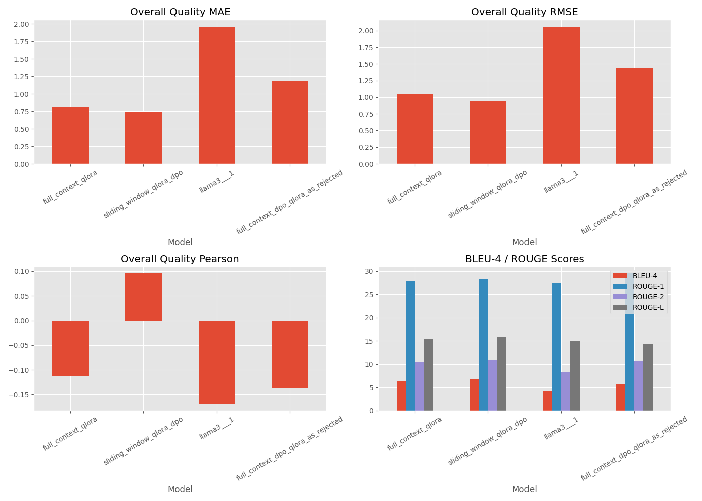

# Automated LLM-Based Peer Review System

This project uses LLM to auto-reviews the research paper.

###  Data Preparation

- We crawled papers from openreview with top venues papers (e.g. ICML, NIPS, ICLR, CVPR) along with their reviews. The dataset is published in Huggingface and made public: 
  - [Dataset (raw)](https://huggingface.co/datasets/guochenmeinian/openreview)
  - [Dataset (ready for training)](https://huggingface.co/datasets/guochenmeinian/openreview_dataset)

- We used [Nougat-OCR](https://github.com/facebookresearch/nougat) to parse the PDF. Here's a [usage](https://github.com/ad17171717/YouTube-Tutorials/blob/main/Machine%20Learning%20with%20Python/Optical_Character_Recognition_(OCR)_with_Meta's_Nougat!.ipynb) guide I found. With the raw dataset, We used GPT-4-mini to format/merge reviews to prepare the dataset for training.

Here's a sample of the structured output we prepared for training:
```markdown
### Key Points
This paper presents an online learning framework for Markov Decision Processes (MDPs) with countably infinite states, utilizing a Bayesian perspective where MDP parameters follow a prior distribution. The authors propose a Thompson-sampling-like approach to solve the MDP, assuming access to an optimal policy oracle. The learning goal is Bayesian regret minimization, achieving a regret bound of \(\sqrt{TA}\) under certain assumptions. The paper contributes to theoretical reinforcement learning by providing near-optimal algorithms for unbounded state spaces and includes empirical simulations demonstrating the algorithm's performance.

### Strengths and Weaknesses
Strengths:
- The model exhibits high generality and contributes significantly to theoretical reinforcement learning.
- The combination of Lyapunov analysis with existing proofs offers valuable insights for future research.
- The empirical simulations provide evidence supporting the algorithm's performance.
Weaknesses:
- The reliance on assumptions, particularly Assumption 3 regarding stability, may limit practical applicability and verification.
- The algorithm's dependence on an oracle for optimal policy solutions poses challenges for general queueing systems.
- The requirement to return to state 0 at the end of each episode could lead to impractical exponential dependencies.
- The paper lacks clarity in presenting constants related to theoretical results, which are crucial for practical performance.

### Suggestions for Improvement
We recommend that the authors improve the clarity of the assumptions, particularly Assumption 3, by discussing its implications for stability in more general systems. It would be beneficial to explore heuristics for designing the parameter and policy spaces to ensure this assumption holds. Additionally, we suggest testing the algorithm in more general systems and clarifying the necessity of the optimal policy oracle, possibly by presenting results in a comparative form against simpler policies like MaxWeight. The authors should also address the dependence of regret on system size and ensure consistent terminology by using either "queueing" or "queuing" throughout the paper. Finally, we advise revising the abstract for conciseness and improving the overall writing quality to enhance readability.

### Rating
Overall Quality: 6.2
Review Confidence: 3.2
```

---

###  Model Training

- We first used [LLaMA-Factory](https://github.com/hiyouga/LLaMA-Factory) to fine-tune the **LLaMA 3.1-8B-Instruct-8K model** using **QLoRA**. We ran the training on **five NVIDIA 4090 GPUs** through **AutoDL**. LLaMA-Factory provided a convenient interface for quick experimentation. After that, we gradually moved to writing our own training and inference code, and explored key tools such as **Hugging Face Transformers**, **Accelerate**, and **DeepSpeed**, which deepened our understanding of model loading, memory optimization, and distributed training workflows.

- After supervised fine-tuning (SFT) with QLoRA, we are currently working on **Direct Preference Optimization** (DPO) to further align the model with human preferences. Our idea is: while QLoRA teaches the model to reproduce structured reviews, DPO will push the model to prefer higher-quality, better-structured responses by optimizing preferences between "good" and "bad" outputs. Our goal is to compare how different sources of "rejected" outputs affect model preference learning. Specifically, we plan to evaluate DPO results using negative samples from:
- **Original LLaMA 3.1 outputs** (zero-shot)
- **QLoRA fine-tuned model outputs**

(Ideally) The matching ratings between the reviews generated by our model and the manual reviews would surpass the effect of GPT-4 reviewers, which improves the accuracy of automated review.


---

### Model Evaluation

We evaluated the fine-tuned model using both **rating prediction metrics** and **natural language generation (NLG) metrics**.

#### Rating Prediction Evaluation

We calculated **MAE (Mean Absolute Error)**, **RMSE (Root Mean Squared Error)**, and **Pearson correlation** based on the predicted and ground-truth ratings (Overall Quality under the Rating section).

- **MAE** reflects the **average prediction deviation** across samples — how close the predictions are to the true ratings on average.
- **RMSE** emphasizes **large prediction errors** due to the square operation — it is more sensitive to outliers or serious mistakes.
- **Pearson correlation** measures the **linear relationship** between the predicted and ground-truth ratings — a higher correlation suggests better trend alignment.

We consider both MAE and RMSE together to better understand model behavior:

| Situation            | Interpretation                            |
|----------------------|-------------------------------------------|
| Low MAE, Low RMSE     | Accurate and stable predictions          |
| Low MAE, High RMSE    | Generally good but with some big errors  |
| High MAE, High RMSE   | Overall poor performance                 |

Thus, both metrics are complementary to assess overall quality and stability.

#### Natural Language Generation Evaluation

We also used standard generation metrics from HuggingFace evaluation in LLaMA-Factory:

- **BLEU-4**: Measures n-gram overlap between generated and reference texts.
- **ROUGE-1/ROUGE-2/ROUGE-L**: Measures overlap of unigrams, bigrams, and longest common subsequences between generation and references.

These metrics assess the **fluency, relevance, and content preservation** of the generated reviews compared to ground-truth human reviews.

By combining both **rating-based evaluation** and **generation quality evaluation**, we hope to comprehensively evaluate the model's ability to generate faithful, informative, and structured peer reviews.





### Observations from Experiments

We noticed that:
- DPO does improve generation quality
- QLoRA-based DPO leads to more effective learning
When using LLaMA3.1 outputs as rejection, the model showed nearly zero loss most of the time—too trivial.
But with QLoRA outputs as rejection, DPO training produced non-zero loss curves and improvements.
- Despite lacking full context (only 8192 tokens), the sliding-window QLoRA model can still generalize unexpected well. Meanwhile, the sliding-window QLoRA DPO model seems to have the best performance. There might be many factors that cause this. For example: for the sliding window model, each sample we feed multiple parts of the paper with overlaps instead of one whole paper just once due to the nature of the sliding window approach, so the sliding window model actually has been trained with much more data


